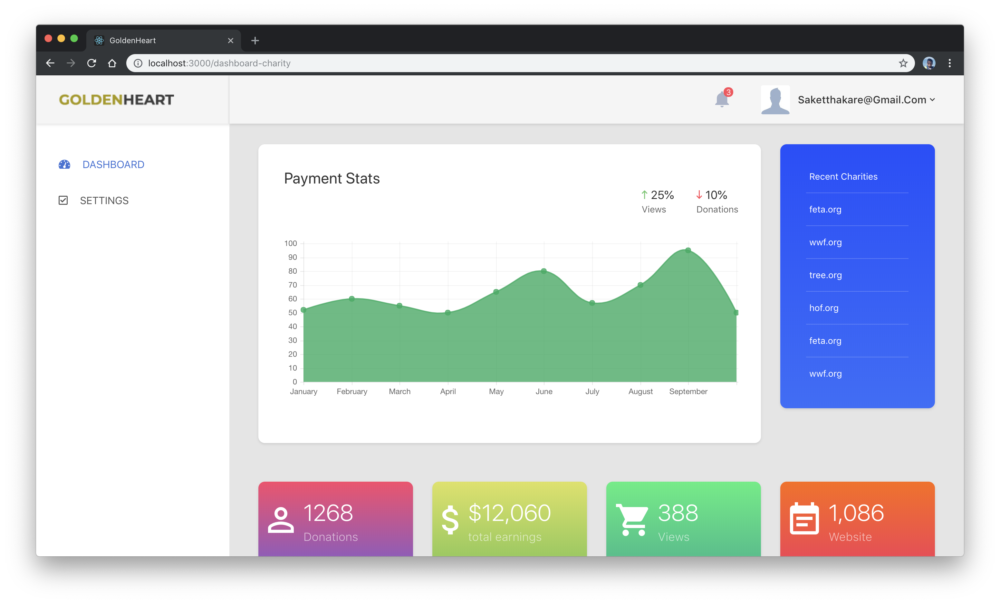
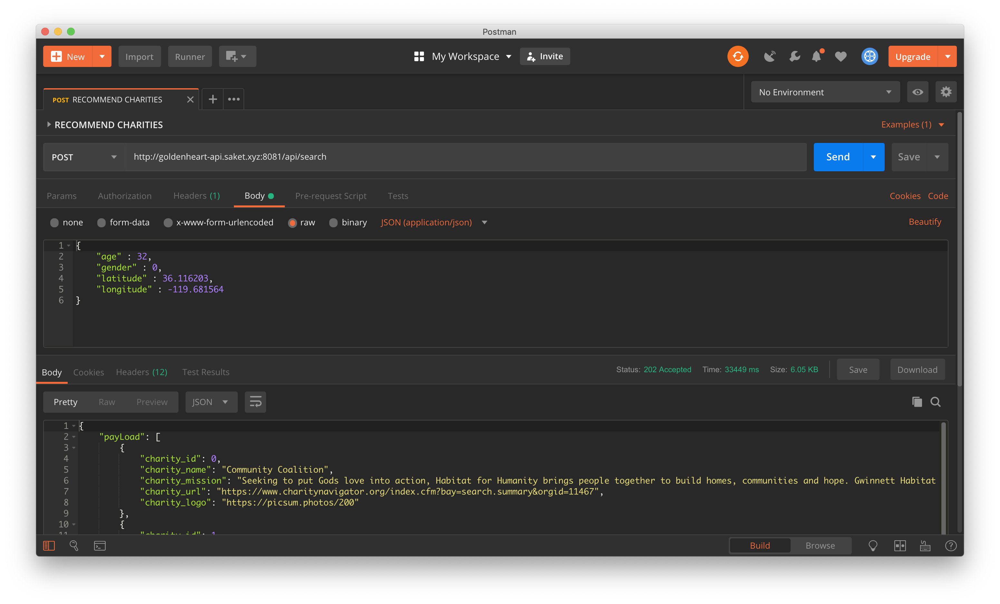
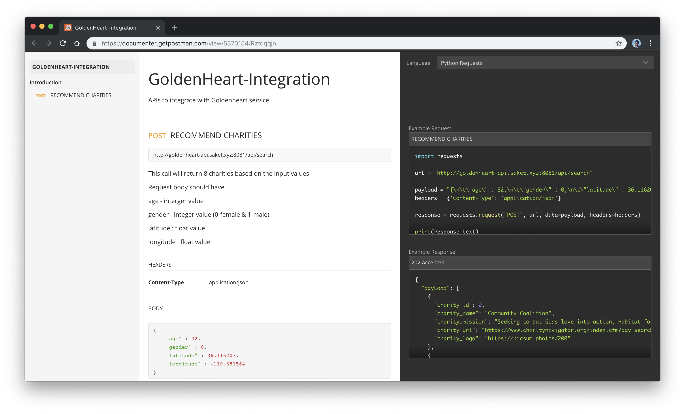

# CMPE-272 Project-Team-19

## Project-Team-19 members

- [Ajinkya Thakare](https://www.linkedin.com/in/aj1thakare)
- [Arman Pathan](https://www.linkedin.com/in/arman-pathan-216b49156)
- [Sarthak Singhal](https://www.linkedin.com/in/sarthak-singhal)
- [Saket Thakare](https://www.linkedin.com/in/saket-thakare)

## GoldenHeart

Project Description: GoldenHeart aims to bring together businesses and charities on a single platform. Using the website, the businesses and charities will be registered with us to use our API. Once they have been registered, a business can show a list of charities to its customers and ask its users to choose a charity to which the business will donate a certain percentage of the purchase price. What’s unique in GoldenHeart is that the API will consume the business customer’s data and predict the charities the customer is more likely to choose for business to donate. Using our API, businesses will be able to increase the customers engagement in doing some good for the community. The charities registered with us, will be able to increase its funding since they will be matched to the customers who are more like to choose it.

## InAction

### Charity Dashbboard View

### API in action

### API Documentation. [View Documentation](https://documenter.getpostman.com/view/5370154/Rzfdqqjn)

